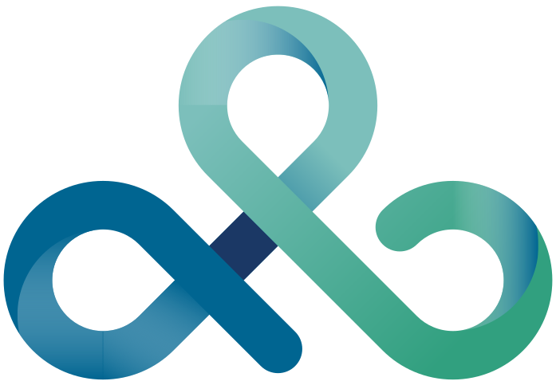

# Track & Learn

Track & Learn is a web application made for educators.  
Developed with [Next.js](https://nextjs.org), [Supabase](https://supabase.com), and [Google Gemini](https://ai.google/).

## Initial Setup

Clone the repository and install dependencies:

```bash
git clone https://github.com/pablosgr/TrackAndLearn.git
cd TrackAndLearn
pnpm install
```

## Database Setup with Supabase

1. Create a new project on [Supabase](https://supabase.com/).
2. Go to your project’s **API Settings** and copy the **Project URL** and **anon public key**.
3. Add them to your local `.env` file:

```env
NEXT_PUBLIC_SUPABASE_URL=your-supabase-url
NEXT_PUBLIC_SUPABASE_ANON_KEY=your-supabase-anon-key
```

⚠️ **Important:**

For users to create and assign tests, the `topic` table must be populated with some data.

## Generative AI Setup (Gemini)

This project integrates **Google Gemini** for generative AI features.  

1. Create a project in [Google Cloud Console](https://console.cloud.google.com/).
2. Enable the **Gemini API** (see [Google AI Studio](https://ai.google.dev/)).
3. Generate an API key for Gemini.
4. Add it to your local `.env` file:

```env
NEXT_PUBLIC_GEMINI_API_KEY=your-gemini-api-key
```

## Development

Run the development server:

```bash
pnpm dev
```

The app will be available at [http://localhost:3000](http://localhost:3000).

## Acknowledgments

<p align="center">
  
</p>

This project was developed thanks to [Aircury S.L.](https://www.aircury.es/)'s _Summer of Code_ 2025, a mentorship initiative designed to help students gain real-world experience by developing meaningful projects.
